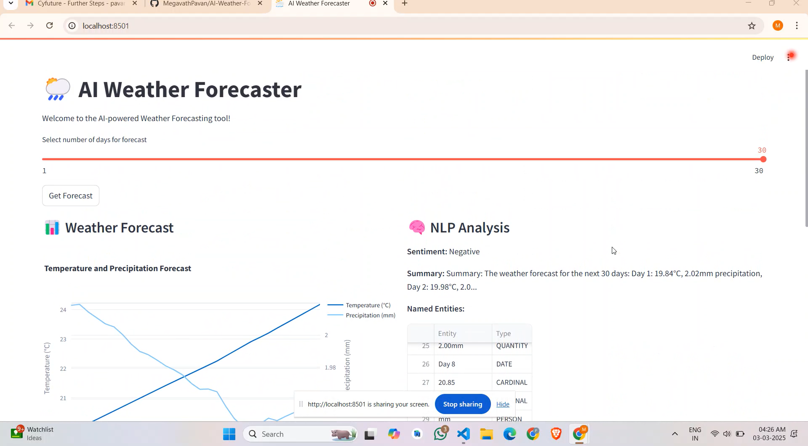
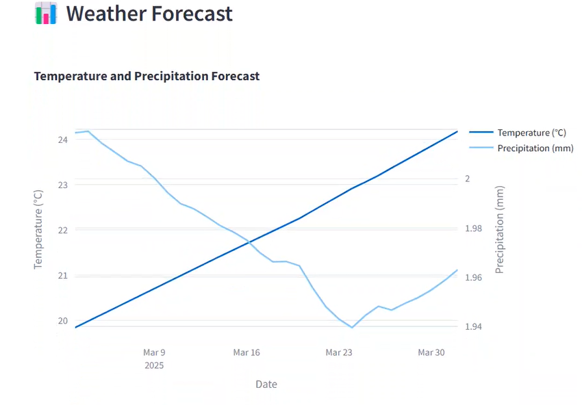

# AI Weather Forecaster

## Overview
The **AI Weather Forecaster** is a machine learning-based weather prediction system that utilizes an LSTM (Long Short-Term Memory) model to forecast temperature and precipitation. It integrates natural language processing (NLP) techniques to generate textual summaries, analyze sentiment, and extract named entities from forecasts. The project provides a **FastAPI backend** for weather predictions and a **Streamlit-based UI** for user interaction and visualization.

## Features
- **Weather Forecasting**: Uses LSTM neural networks to predict future temperatures and precipitation levels.
- **NLP Analysis**: Tokenization, Named Entity Recognition (NER), Sentiment Analysis, and text summarization using NLTK and spaCy.
- **FastAPI Backend**: Serves predictions via a REST API.
- **Streamlit Frontend**: Interactive web app for visualization and user-friendly forecast analysis.
- **Plotly Visualizations**: Interactive charts for forecast trends.

## Technologies Used
- **Python**
- **FastAPI** (REST API for forecasts)
- **Streamlit** (Web UI)
- **TensorFlow/Keras** (LSTM model)
- **NLTK & spaCy** (NLP processing)
- **Pandas & NumPy** (Data handling)
- **Plotly** (Visualizations)
- **scikit-learn** (Data scaling)
- **Requests** (API communication)

## Installation

### Prerequisites
Ensure you have Python 3.8+ installed on your system.

### Clone the Repository
```sh
git clone https://github.com/MegavathPavan/AI-Weather-Forecaster.git
cd ai-weather-forecaster
```

### Install Dependencies
```sh
pip install -r requirements.txt
```

### Download NLP Models
```sh
python -m spacy download en_core_web_sm
```

## Running the Application

### Start FastAPI Server
```sh
uvicorn ai_weather_forecaster:app --reload
```

### Run Streamlit UI in a seperate terminal
```sh
streamlit run ai_weather_forecaster.py
```

## API Usage

### Endpoint: `/forecast`
- **Method**: `POST`
- **Request Body**:
  ```json
  {
    "days": 7
  }
  ```
- **Response**:
  ```json
  {
    "forecast": [
      {"Date": "2025-03-04", "Temperature": 22.5, "Precipitation": 1.2},
      {"Date": "2025-03-05", "Temperature": 21.8, "Precipitation": 0.8}
    ],
    "nlp_analysis": {
      "tokens": ["The", "weather", "forecast", ...],
      "entities": [["2025-03-04", "DATE"]],
      "sentiment": "Positive",
      "summary": "Summary: The weather forecast for the next 7 days..."
    }
  }
  ```

## Screenshots

### Streamlit UI


### Forecast Visualization


## Future Improvements
- Enhance model accuracy with real-world weather datasets.
- Deploy on cloud platforms (AWS/GCP/Azure).
- Add multi-city weather forecasting support.
- Improve NLP-based summary generation.

## License
-----------.

---
### Contributors
- [Megavath Pavan](https://github.com/MegavathPavan)

